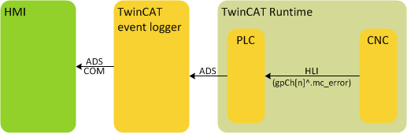
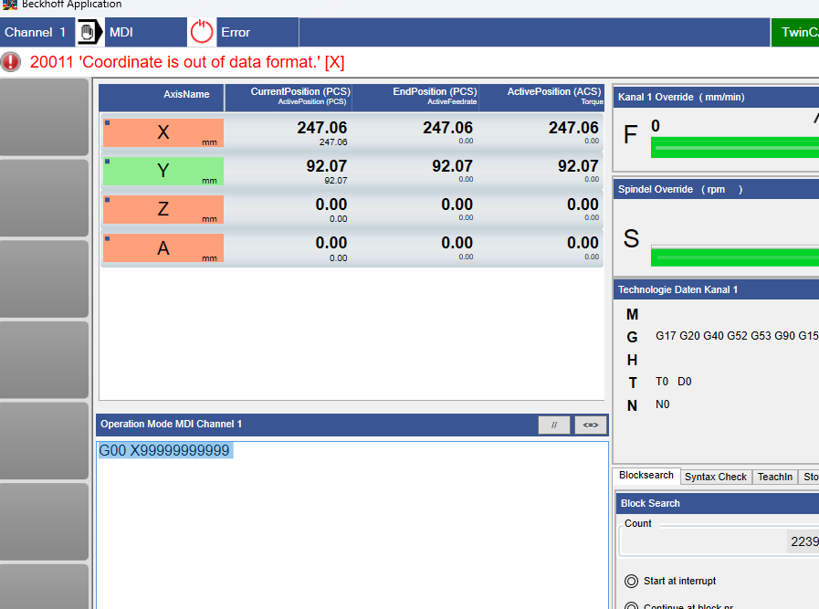
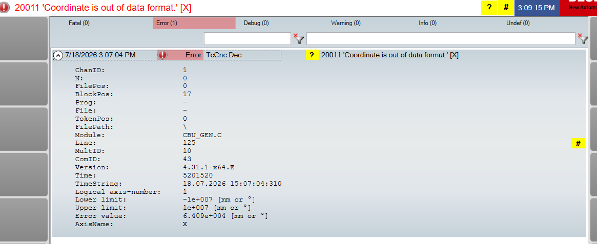
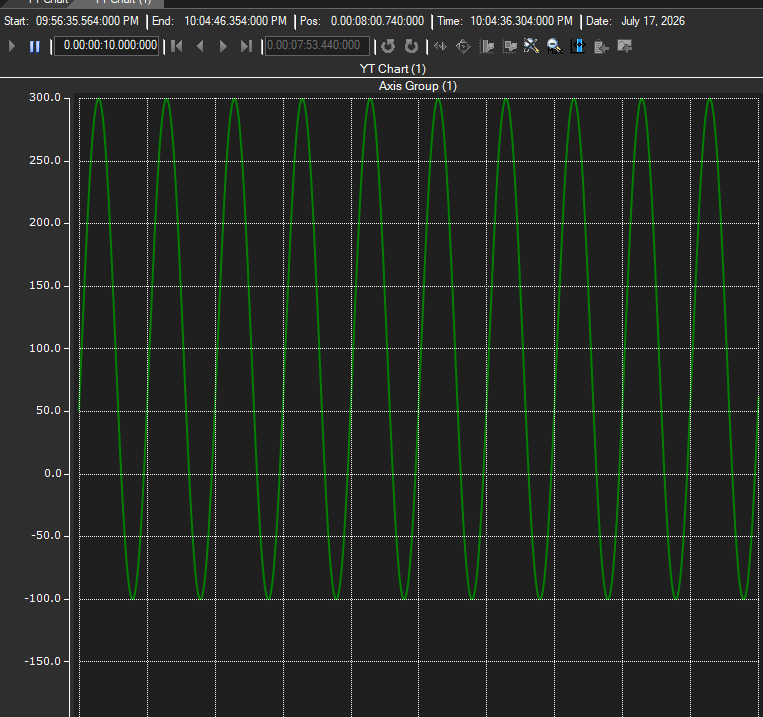
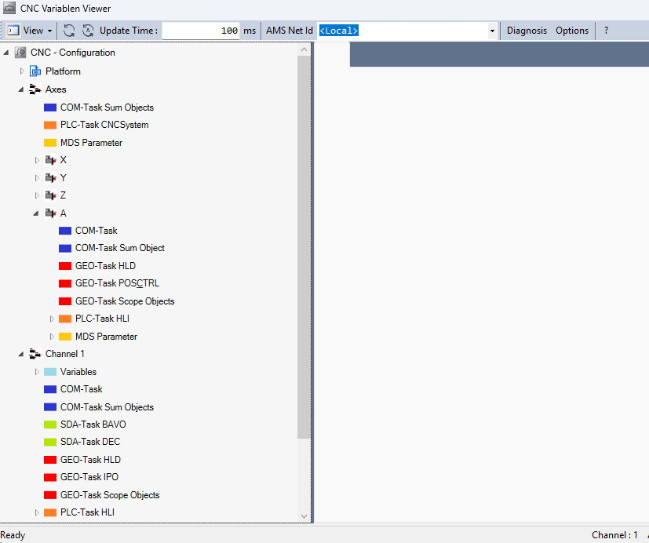
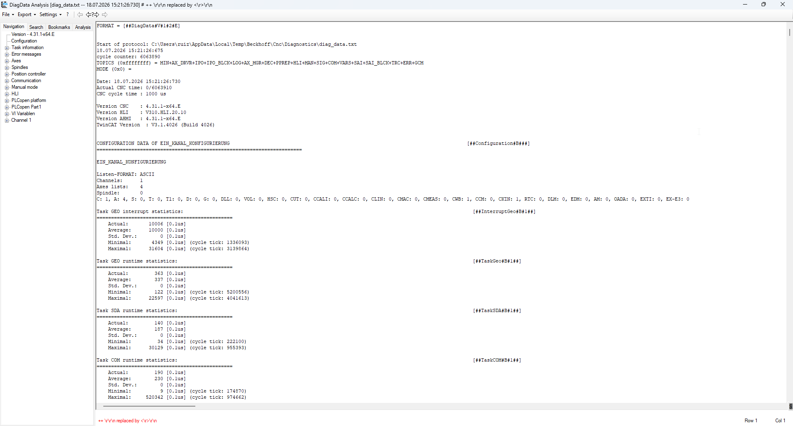

# CNC Diagnosis

## CNC Error Message

## Tracing PLC variables using scope

## Tracing HLI Content using scope

* Open up the application of TcCNCVariableViewer

        ..\CNC_HMI\TcCNCVariablenViewer

## Tracing CNC internal values using scope

## CNC Diagnosis Tool 

* TwinCAT CNC is shipped with a console tool called „ahmi_ads.exe“.

        4024 : C:\TwinCAT\3.x\Components\Mc\CNC\Diagnostics
        4026 : C:\Program Files (x86)\Beckhoff\TwinCAT\3.1\Components\Mc\Cnc\Diagnostics

* dump.bat file

        md %temp%\Beckhoff\Cnc\Diagnostics 
        start /wait ahmi_ads.exe -dump -diag_data_file %temp%\Beckhoff\Cnc\Diagnostics\diag_data.txt 
        start /wait %windir%\EXPLORER.EXE /e ,%temp%\Beckhoff\Cnc\Diagnostics

* Double Click on „dumb.bat“ creates diagnostic data file „diag_data.txt“

        C:\Users\ruiz\AppData\Local\Temp\Beckhoff\Cnc\Diagnostics

    

## CNC Support Request Process

- If issues are related to TwinCAT CNC, the following files may speed up finding the solution:
    - [ ] Written error description
    - [ ] TwinCAT project file containing the whole configuration and PLC program 
    - [ ] Any NC programs involved in the issue, including explicitly and implicitly called subroutines.
    - [ ] Dump file diag_data.txt created right after the error occurred.
    - [ ] Meaningful scope data files (*.svd)
    - [ ] If used, log files created by the Beckhoff HMI (saved in subfolder Log)

