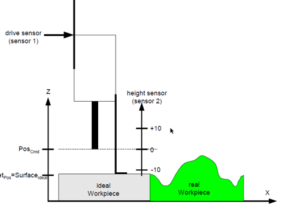
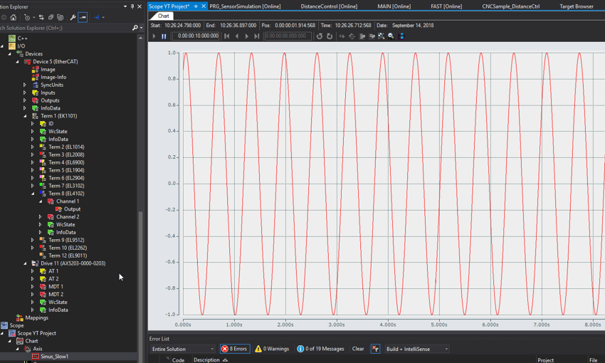
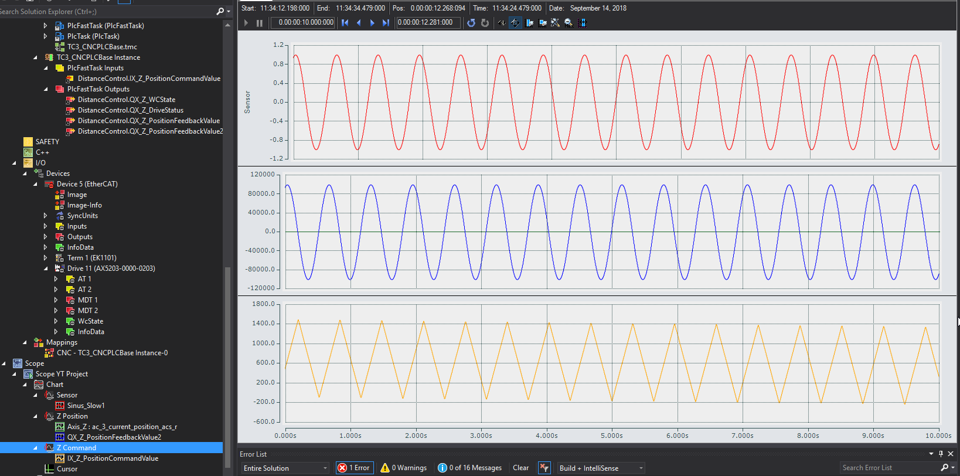

# CNC Distance Control

## Concept

- Use the height sensor value (EL3102 Ch1) as the 2nd feedback value for Z axis
- Add Parameter S-0-0053 Position Feedback value 2 (external feedback) for Z axis in AX5000

## Simulation 

- [ ] Add Parameter S-0-0053 Position Feedback value 2 (external feedback) for Z axis in AX5000

- [ ] Add the below parameters to Z axis

        # Distance Control
        lr_hw[1].encoder_resolution_num                         1
        lr_hw[1].encoder_resolution_denom                       1

            
        lr_hw[1].vz_istw                                        0             
        lr_hw[1].mode_act_pos                                   0             

        lr_param.distance_control_on				1
        kenngr.distc.n_cycles                                   5             	# Zyklenzahl, Mittelwertfilter des Tastgebers
        
        kenngr.distc.max_deviation                              5000000       	# [0.1um] Max. zulaessige Abweichung
        
        kenngr.distc.v_max                                      500           # [um/s] Max. Geschw. der Abstandsregelung
        
        kenngr.distc.a_max                                      100           # [mm/s*s] Max. Beschleunigung
        
        kenngr.distc.max_act_value_change                       50000000      	# Max. Istwertsprung / Zyklus
        
        kenngr.distc.ref_offset 				0 		# Offset Referenzpunkt
        
        kenngr.distc.max_pos 					20000 		# [0.1um] Max. Position
        
        kenngr.distc.min_pos 					-20000 		# [0.1um] Min. Position
        kenngr.distc.tolerance                                  0             	# [0.1um] Toleranzwert der Tasttiefe
        
        kenngr.distc.check_sw_limit_switch                      1             	# Offset der Abstandsregelung überwachen
        
        kenngr.distc.optimized_scheduling 			1 		# Opt. Scheduling aktiv
        
        kenngr.distc.mode_dist_use_both_encoder 		1 		# Motor und Abstandsgeber aktiv

- [ ] Import DistanceControl.xml : GVL declaration

- [ ] Import PRG_DistanceControl.xml : logic of Distance Control implementation

- [ ] Import PRG_DriveSim.xml : AX5000 Drive Simulation for Status Word, Feedback, Position and WcState

- [ ] Import PRG_SensorSimulation.xml : Height Sensor Signal Simulation (Sin Wave Signal)

    - M91 : Start the height sensor simulation
    - M90 : Stop the height sensor simulation

    - [ ] create M90, M91 commands in channel parameter
                
                m_synch[90]                                 0x00000002              ( MVS_SVS
                
                m_synch[91]                                 0x00000002              ( MVS_SVS
            
    - Or use PLC variables bStart and bStop to start/stop the Sin Signal 
    

- [ ] In Fast POU, add the below code for Distance Control Implementation

        (* VAR Declaration *)
        fDistance: LREAL;
	    bOn : BOOL;
	    bOff : BOOL;

        (* Distance Control Functioanlity*)

        PRG_DriveSim();
        PRG_SensorSimulation();

        PRG_DistanceControl(
            bSimulation  := TRUE,
            fSimSensorValue := Sinus_Slow1*10,
            nChanIdx:= 0, 
            nHliAxisIdx:= 2, 
            fDistance:= fDistance, 
            nFunctionNoOn:= 80, 
            nFunctionNoOff:= 81, 
            bDistanceControlOn := bOn,
            bDistanceControlOff := bOff, 
            dist_ctrl_state=> , 
            dist_ctrl_position=> , 
            dist_ctrl_distance=> , 
            dist_ctrl_act_source=> , 
            dist_ctrl_act_position=> , 
            dist_ctrl_act_offset=> , 
            dist_ctrl_act_distance=> );

- [ ] add M80 and M81 for Distance Control ON and OFF

        m_synch[80]                                 0x00000002              ( MVS_SVS	Distance Control OFF

        m_synch[81]                                 0x00000002              ( MVS_SVS	Distance Control ON

- [ ] Link DistanceControl.QX_Z_PositionFeedbackValue2 to Position feedback 2 value (external feedback)

- [ ] Test G Programming : Distance Control Test.nc (Copy nc files to ..CNC\ folder in target IPC)

        G0 X0 Y0 Z0
        ;P1 = Maximaler Positionsoffset
        ;P2 = Obere Grenze des Sensor-Gebers
        ;P3 = Untere Grenze des Sensor-Gebers
        ;P4 = Endschalter Pos
        ;P5 = Endschalter Neg
        ;P6 = M-Funkt Abstandsregelung Aus
        ;P7 = M-Funkt Abstandsregelung Ein
        Z0
        L CYCLE [NAME=DistControlOn.nc @P1=40 @P2=40 @P3=-40 @P4=40 @P5=-40 @P6=81 @P7=80]
        M91
        G1 F3000
        G1 Y40 F100
        M90
        L CYCLE [NAME=DistControlOff.nc @P6=81]
        M30

    - DistControlOn.nc

            M@P6 ; Dist Control OFF
            Z[DIST_CTRL OFF NO_MOVE] ; Dist Control OFF

            ;Maximum permissible correction value [0.1 µm] P-AXIS-00414
            V.E.strDistControl = "kenngr.distc.max_deviation " + REAL_TO_STR[@P1*10000]
            #MACHINE DATA SYN [AX=Z AXPARAM=V.E.strDistControl]

            ;Sensor's high limit P-AXIS-00419
            V.E.strDistControl = "kenngr.distc.max_pos " + REAL_TO_STR[@P2*10000]
            #MACHINE DATA SYN [AX=Z AXPARAM=V.E.strDistControl]

            ;Sensor's low limit P-AXIS-00420
            V.E.strDistControl = "kenngr.distc.min_pos " + REAL_TO_STR[@P3*10000]
            #MACHINE DATA SYN [AX=Z AXPARAM=V.E.strDistControl]

            ;Soft Limit Switch Pos
            V.E.strDistControl = "kenngr.swe_pos " + REAL_TO_STR[@P4*10000]
            #MACHINE DATA SYN [AX=Z AXPARAM=V.E.strDistControl]

            ;Soft Limit Neg
            V.E.strDistControl = "kenngr.swe_neg " + REAL_TO_STR[@P5*10000]
            #MACHINE DATA SYN [AX=Z AXPARAM=V.E.strDistControl]

            M@P7 ;Dist Control ON
            M17

    - DistControlOff.nc

            Z[DIST_CTRL OFF NO_MOVE] ; Dist Control OFF
            M17

## Video
<video controls width="600">
    <source src="../videos/Distance Control.mp4" type="video/mp4">
    Your browser does not support the video tag.
</video>

## Example
<video controls width="800">
    <source src="../videos/L-MS laser.mp4" type="video/mp4">
    Your browser does not support the video tag.
</video>