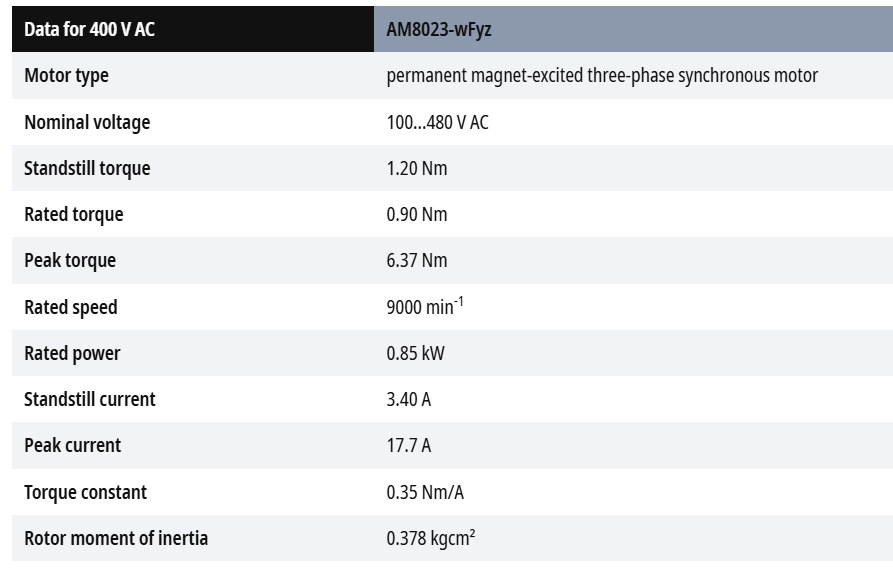
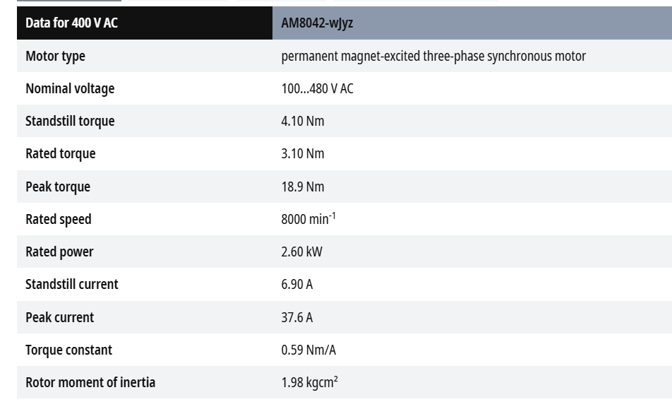

# Servo Drive AX5000

## AX5000 Introduction

* AX5000 Overview 
* AX5000 Spec
    - X Axis : AX5112
    - Y Axis : AX5106
    - Z Axis : AX5103
    - A Axis : AX5106

* AX5 Firmware 
        

## Motors

- X Axis : AL2815 & AMO Absolute linear encoder
- Y Axis : AL2815 & AMO Absolute linear encoder
- Z Axis : AM8023-0F21
    

- A Axis : AM8042-0J21
    

## Drive Manager 2

- Live Demo

## AX5000 Diagnostic 
- Diagnostic Message in [InfoSysy](https://infosys.beckhoff.com/english.php?content=../content/1033/ax5000_diagmessages/index.html&id=7277115246271952853).

- Live Demo