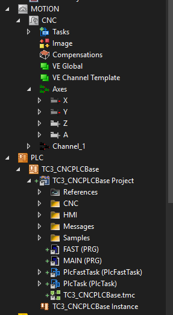
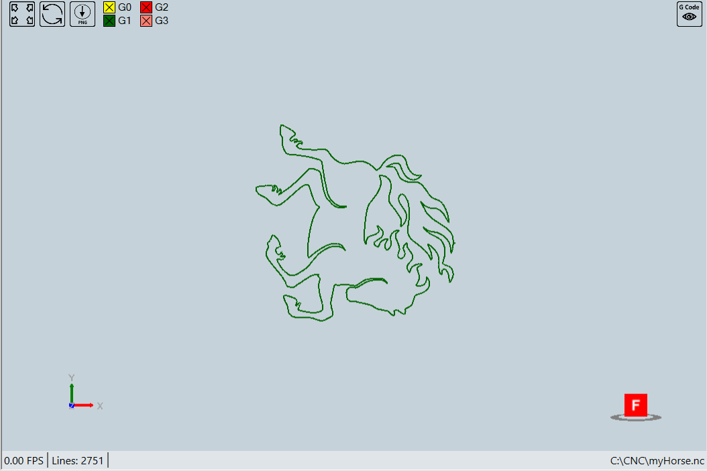

# TwinCAT 3 CNC

For full documentation visit [mkdocs.org](https://www.mkdocs.org).

## CNC Introduction

## CNC USB
- [ ] PLC Base Project 
- [ ] CNC HMI
- [ ] CNC Documents
- [ ] nc files

## CNC Quick Start

- [ ] Create a new TwinCAT Project 
- [ ] Right Click "Motion" node to add a CNC configuration 
- [ ] Right Click "Axis" to add 4 Axes
- [ ] Change the axes names to be "X", "Y", "Z" and "A"

- [ ] Right Click "PLC" node to add "Add Existing Item"

- [ ] Activate the trial license 

- [ ] Activate Configuration 

- [ ] Start CNC HMI
    - [ ] Manual Mode
    - [ ] MDI Mode
    - [ ] Auto Mode

## CNC Parameter List 

- [ ] Mostly needed parameters

    - Channel Paramters

            start_init_prog_file  	start_init.nc       	( P-CHAN-00119 : Name of a sub program implicitly called at program start 
        
            m_synch[34]                        	0x00000002     MVS_SVS  (M Function )prog_start.slope.profile          1      	( P-CHAN-00071 : Type of acceleration profile  (1: active jerk limitation)
            
    
    - Axis parameters 

        - [ ] Scaling Factor
            
                getriebe[0].wegaufz	1048576       ( P-AXIS-00234 : [Incr.] Path resolution of the measuring system  (numerator)
            
                getriebe[0].wegaufn               3600000        ( P-AXIS-00233 : [0.1um] or [10-4degree] Path resolution of the measuring system  (denominator)
            
        - [ ] Velocity, acceleration and jerk
                    
                getriebe[0].slope_profil.a_beschl                	1000          	( P-AXIS-00001 : [mm/s2] or [degree/s2] Acceleration at machining feed G1,G2,G3
                
                getriebe[0].slope_profil.a_brems                      	1000          	( P-AXIS-00002 : [mm/s2] or [degree/s2] Deceleration at machining feed  G1,G2,G3
                
                getriebe[0].slope_profil.a_grenz                      	2000          	( P-AXIS-00004 : [mm/s2] or [degree/s2] Acceleration at rapid movement G0
                
                getriebe[0].slope_profil.tr_beschl_zu                 	30000         	( P-AXIS-00196 : [us] Ramp time for acceleration up-gradation at machining feed G1,G2,G3
                
                getriebe[0].slope_profil.tr_beschl_ab                 	30000         	( P-AXIS-00195 : [us] Ramp time for acceleration down-gradation G1,G2,G3
                
                getriebe[0].slope_profil.tr_brems_zu                  	30000         	( P-AXIS-00198 : [us] Ramp time for deceleration up-gradation G1,G2,G3
                
                getriebe[0].slope_profil.tr_brems_ab                  30000         	( P-AXIS-00197 : [us] Ramp time for deceleration down-gradation G1,G2,G3
                
                getriebe[0].slope_profil.tr_grenz                     	30000         	( P-AXIS-00200 : [us] Ramp time at rapid movement G0
                
                getriebe[0].dynamik.tr_min                            	5000          	( P-AXIS-00201 : [us] Minimum permissible ramp time
                
                getriebe[0].dynamik.tr_geom                           	5000          	( P-AXIS-00199 : [us] Geometric ramp time (ramp time of geometric contours)
                
                getriebe[0].dynamik.vb_max                            	100000        	( P-AXIS-00212 : [um/s] or [10-3degree/s] Maximum permissible axis velocity 
                
                getriebe[0].dynamik.a_max                             	2000          	( P-AXIS-00008 : [mm/s2] or [degree/s2] Maximum permissible axis acceleration 
                
                getriebe[0].dynamik.a_emergency                       	1750          	( P-AXIS-00003 : [mm/s2] or [degree/s2] Deceleration for an emergency stop
                
                getriebe[0].vb_eilgang                                	100000        	( P-AXIS-00209 : [um/s] or [10-3degree/s] Rapid mode velocity
                
                handbetrieb.hb.vb_max                                 	60000	( P-AXIS-00213 : [0.1um/s] or [10-4degree/s] Maximum velocity (G200)
                
                handbetrieb.hb.a_max                                  	300           	( P-AXIS-00009 : [mm/s2] or [degree/s2] Maximum acceleration (G200)
                
        - [ ] Position Lag
            
                getriebe[0].slep_ueberw_typ	4	( P-AXIS-00172 : Type of following error monitoring; 0=disable, 1=standard, 				              		2=linear, 3=non-linear, 4=velocity independent
                
                getriebe[0].slep_min                         	15000         	( P-AXIS-00169 : [0.1um] or [10-4degree] following error on axis standstill
                
                getriebe[0].slep_max                         	100000        	( P-AXIS-00168 : [0.1um] or [10-4degree] following error during movement
                
                lr_param.suppress_pos_lag_error     0             	( P-AXIS-00176 : Suppression of position lag monitoring
                
                antr.use_drive_following_error	1	( P-AXIS-00466 : Drive based position lag calculation	

        - [ ] Soft Limits
            
                kenngr.swe_toleranz                                   100           	( P-AXIS-00179 : Tolerance range for software limit switch
                
                kenngr.swe_pos                                        15000000      	( P-AXIS-00178 : [0.1um] or [10-4degree] Positive software limit switch 
                
                kenngr.swe_neg                                        -10000000     	( P-AXIS-00177 : [0.1um] or [10-4degree] Negative software limit switch
                

        - [ ] Motor Direction
            
                lr_hw[0].vz_istw                                       	0/1      	( P-AXIS-00230 : Sign reversal of actual value
                
                lr_hw[0].vz_stellgr                                   	0/1           	( P-AXIS-00231 : Sign reversal of command value
                
                

- [ ] CNC HMI

    - Beckhoff Standard CNC HMI
    - BOS CNC HMI

