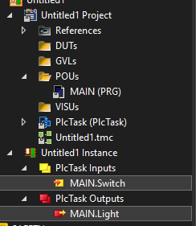

# TwinCAT 3 Overview

## TwinCAT Introduction

## TwinCAT Quick Start

- [ ] Create a new TwinCAT project - XAE Project
- [ ] Scan IO Devices
- [ ] Remote Connection to the target IPC 
    - [ ] Make sure the TCPIP connection between IPC and laptop
    - [ ] User : Administrator Password : 1 (By Default)
- [ ] Append NC PTP Axis 
- [ ] Append PLC Project 
    - [ ] Add the below code in Main.POU
        
        `iCounter := iCounter + 1;` 

- [ ] Add the below code for IO Testing

        Light	AT%Q*: BOOL;
	    Switch	AT%I*: BOOL;

        Light := Switch; 

- [ ] Map IO

    

- [ ] Test your IO application 

- [ ] Add the below code for Sin Wave 
    
        PROGRAM MAIN
            VAR
                iCounter: UDINT;
                
                
                fAmplitude : LREAL := 100.0;      // Amplitude
                fFrequency : LREAL := 1.0;        // Frequency
                fOffset    : LREAL := 0.0;        // Offset

                fTime      : LREAL := 0.0;        // Current Time(s)
                fCycleTime : LREAL := 0.001;      // PLC 1ms

                fOutput    : LREAL;

                PI         : LREAL := 3.141592653589793;
            END_VAR

        // Cycle Time 
            fTime := fTime + fCycleTime;

        // SIN WAVE
            fOutput := fOffset + fAmplitude * SIN(2.0 * PI * fFrequency * fTime);

        // limit
            IF fTime >= 1000 THEN
                fTime := 0;
            END_IF;

- [ ] Add Scope

