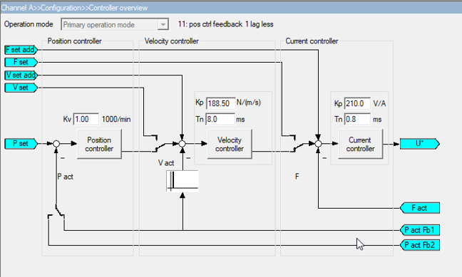
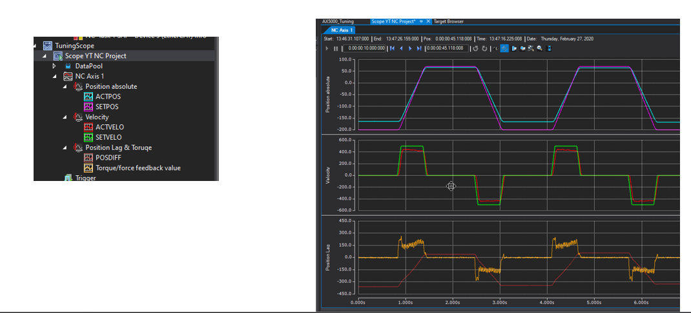
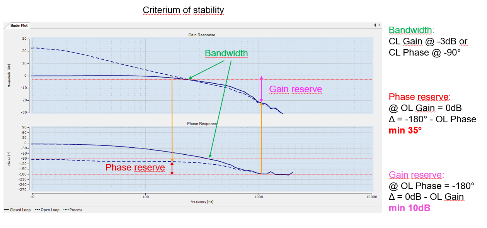

# Tuning

For full documentation visit [mkdocs.org](https://www.mkdocs.org).

## Step Response - PID Control

    N10 :G00 Y0
    N20 G04 0.5
    N30 Y300
    N40 G04 0.5
    $GOTO N10 

## Frequency Response - Bode Plot 

- Motion Task needs to be less than 1ms for oversampling

- [ ] Right Click the master to add "Dyn Container"
- [ ] Set 512 Bytes
- [ ] Under TcCOM Objects -> Class Factories : Enable "TcNcObjects" and "TcBodePlot" 

<video controls width="800">
    <source src="../videos/Tuning.mp4" type="video/mp4">
    Your browser does not support the video tag.
</video>

## Auto Tuning
- Live Demo
