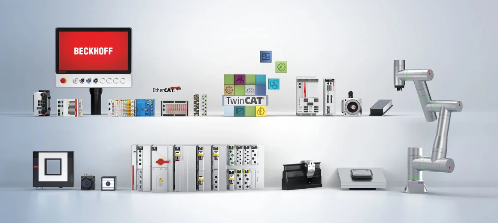
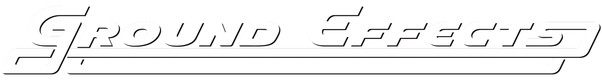

# Welcome to CNC Training

This document is used for CNC Training for BOS innovations and GFX

   

# AGENDA: 

## TwinCAT 3 Overview

* TwinCAT Introduction 
* TwinCAT Quick Start

## System Maintenance

* Upload Project 
* BST

## Servo Drive - AX5000

* AX5000 Introduction 
* Drive Manager 2
* AX5000 Diagnostic

## TwinCAT CNC 

* CNC introduction
* CNC Quick Start
* CNC Standard HMI
* CNC Configuration list
* HLI
* Scopeview
* CNC Message

## EtherCAT Diagnosis

## CNC Diagnosis

## CNC - Distance Control

## Servo Drive - Tuning

## QA 

## Contact

